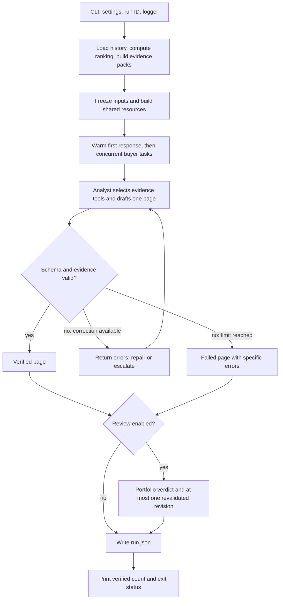

# Follow one run

Start with `src/acquirer_engine/cli.py:run_product`, then
`src/acquirer_engine/run_command.py:execute_run` and `execute_prepared`.
The latter contains the whole-run sequence. `llm/pipeline.py` schedules buyers;
it is not the complete product pipeline.

The diagram summarizes control flow. Provider failures and resource limits end
that page directly; they do not enter the validation-repair route. Other buyer
tasks continue. The CLI exits nonzero if any page or the portfolio review fails.

| Read in this order | What it owns |
| --- | --- |
| `cli.py` | Flags, mode, settings, run identity, logger, display, exit code |
| `run_command.py` | Prepare ranked inputs, own the live client, execute the portfolio, persist output |
| `llm/pipeline.py` | Warm-up, concurrency semaphore, stable output order |
| `llm/analyst.py` | Select normal/sparse prompt and drive one buyer through generation and recovery |
| `llm/attempts.py` | Execute one generation and retain its messages, validation outcome, and claims |
| `llm/router.py` | Decide pass, repair, escalate, or banner from the outcome and configured limits |
| `llm/reviewer.py` | Optional cross-page critique and one validated revision per flagged page |

Agent construction currently also lives in `llm/analyst.py:build_services`.
It happens before buyer tasks start: shared agents, evidence queries, recording
model, cache, ledger, and trace are built once. The reviewer uses these same
resources. No buyer creates its own provider client.

For a deeper inspection, follow the boundary relevant to the question:

| Question | Where to look |
| --- | --- |
| Why this buyer and score? | `features/acquirer.py`, `ranking/scorer.py`, `ranking/signals.py` |
| Which facts were supplied initially? | `evidence/pack.py` |
| Which facts did the model actually fetch? | `llm/bindings.py`, `llm/tools.py`, `llm/tool_state.py` |
| Why did a number or citation fail? | `validation/claims.py`, `validation/numbers.py` |
| How is feedback attached to a rejected draft? | `validation/repair.py` |
| Why did a request wait or stop? | `llm/recording.py`, `llm/budget.py`, `llm/client.py` |
| What did a returned response cost? | `llm/cost.py` and the call entries in `run.json` |
| Where are the model conversation and continuation state? | `llm/session.py`, local `trace.jsonl` |

Shared state reaches code through `Deps.runtime`. Each buyer has its own
`ToolState`, accessed by the framework through `PageDeps`. The verifier sees only
that buyer's core evidence and actual returned tool evidence. The saved
`PageSession` retains the conversation for a possible reviewer revision.

## Live, cache replay, and historical replay

- `acquirers run --fresh`: prepare current inputs and make provider requests.
- `acquirers run --replay`: prepare current inputs and use matching response-cache
  entries; a miss fails without a provider fallback.
- `acquirers replay RUN_ID`: load frozen inputs from the selected `snapshot.json`
  and responses from `trace.jsonl`, then enter `execute_prepared` with no client.

`llm/archive.py` owns frozen inputs; `llm/trace_replay.py` matches historical
responses to conversations. `llm/cache.py` owns content-addressed response reuse.
These are separate contracts. Historical replay writes a new run and retains
lineage to the original; it does not overwrite the source archive or run old code.
Missing responses from interrupted calls cannot be reconstructed as live answers.

## Evaluation takes another path

`acquirers eval` enters `cli.py:run_evaluation`, which prepares measured graders
and writes a scorecard through `evals/harness.py` and `evals/scorecard.py`.
Supplied analyst run files are read as observations; evaluation never drafts pages.
The product path does not execute graders. Judge evaluation and rendered reports
remain later deliverables.
