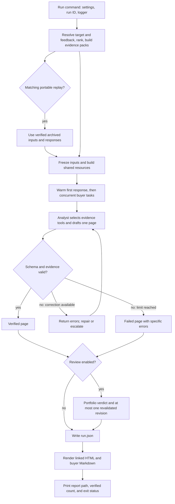

# Follow one run

Start with `src/acquirer_engine/run_command.py:run_product`, then
`src/acquirer_engine/pipeline.py:execute_run` and `execute_prepared`.
The latter reads in execution order: freeze inputs, build resources, run buyer
pages, optionally review, then save the result.

The diagram summarizes control flow. Provider failures and resource limits end
that page directly; they do not enter the validation-repair route. Other buyer
tasks continue. The CLI exits nonzero if any page or the portfolio review fails.

| Read in this order | What it owns |
| --- | --- |
| `cli.py` | Register command names |
| `run_command.py` | Flags, settings, run identity, logger, display, exit code |
| `selection.py` | Resolve target and saved feedback, score, select, build evidence |
| `pipeline.py` | Prepare ranked inputs, execute the portfolio, persist output |
| `llm/batch.py` | Warm-up, concurrency semaphore, stable output order |
| `llm/analyst.py` | Select normal/sparse prompt and drive one buyer through generation and recovery |
| `llm/attempts.py` | Execute one generation and retain its messages, validation outcome, and claims |
| `llm/router.py` | Decide pass, repair, escalate, or banner from the outcome and configured limits |
| `llm/reviewer.py` | Optional cross-page critique and one validated revision per flagged page |

`bootstrap.py` owns client lifetime and `build_services`: agents, evidence
queries, recording model, cache, ledger, and trace are built before buyer tasks
start. `llm/agents.py` declares the agents and their output validators. The
reviewer uses the same resources. No buyer creates its own provider client.

For a deeper inspection, follow the boundary relevant to the question:

| Question | Where to look |
| --- | --- |
| Why this buyer and score? | `features/acquirer.py`, `ranking/scorer.py`, `ranking/signals.py` |
| Which facts were supplied initially? | `evidence/pack.py` |
| Which facts did the model actually fetch? | `llm/bindings.py`, `llm/tools.py`, `llm/context.py` |
| Why did a number or citation fail? | `validation/claims.py`, `validation/numbers.py` |
| Which explicit margin comparisons are checked? | `validation/comparisons.py`; this is not general semantic verification |
| Where do visible deal financials come from? | `report/facts.py` resolves cited source rows; templates display their stated values |
| How is feedback attached to a rejected draft? | `validation/repair.py` |
| Why did a request wait or stop? | `llm/recording.py`, `llm/budget.py`, `llm/client.py` |
| What did a returned response cost? | `llm/cost.py` and the call entries in `run.json` |
| Where are the model conversation and continuation state? | `llm/context.py`, local `trace.jsonl` |

Shared state reaches code through `Deps.runtime`. Each buyer has its own
`ToolState`, accessed by the framework through `PageDeps`. The verifier sees only
that buyer's core evidence and actual returned tool evidence. The saved
`PageSession` retains the conversation for a possible reviewer revision.

The core pack prioritizes exact target-sector deals before recency, retaining the
same row and byte caps. Closed, Pending and resolved counts retain the full buyer
history scope even when displayed rows are truncated. The analyst still needs
tools for Closed valuation comps and population sector benchmarks.

## Live, cache replay, and historical replay

- `acquirers run --fresh`: prepare current inputs and make provider requests.
- `acquirers run --replay`: prepare current inputs and use matching response-cache
  entries when no bundle is installed. A committed portable bundle is checked
  first for exact inputs, feedback, prompt, policy and file integrity. A mismatch
  fails without a provider fallback.
- `acquirers replay RUN_ID`: load frozen inputs from the selected `snapshot.json`
  and responses from `trace.jsonl`, then enter `execute_prepared` with no client.

`llm/archive.py` owns frozen inputs; `llm/trace_replay.py` matches historical
responses to conversations. `llm/cache.py` owns content-addressed response reuse.
These are separate contracts. Historical replay writes a new run and retains
lineage to the original; it does not overwrite the source archive or run old code.
Failed requests replay their typed error. For older archives, only explicit
validation/reviewer failure records restore a known budget or timeout outcome.
Missing responses are never reconstructed as model answers or billed usage.

## Evaluation takes another path

`acquirers eval` enters `evals/command.py:run_evaluation`, which prepares measured graders
and writes a scorecard through `evals/harness.py` and `evals/scorecard.py`.
Supplied analyst run files are read as observations; evaluation never drafts pages.
The product path does not execute graders. Judge evaluation remains separate
from report generation; missing human calibration remains explicitly unmeasured.

`evals/observations.py` validates saved-run identity and source/prompt cohorts.
Evaluation tests live together in `tests/evaluation`; shared factories live in
`tests/fixtures`, alongside the hand-built ranking and rationale fixtures.

## Display, preferences, and comparison

`report/render.py` projects public fields into small Jinja templates. `report/evidence.py`
resolves every visible citation against archived rows and computed statistics before
any file is written. Working notes remain in the structured run, never the pages.

`target_input.py` owns YAML/flag precedence. `feedback/state.py` saves named exclusions;
`feedback/ranking.py` applies a disclosed similarity penalty after the base scorer.
`selection.py` is the single input-preparation path for product runs and comparisons.

`comparison/command.py` prepares two selections, computes their differences through
`comparison/ranking.py`, and saves a table. The optional `comparison/summary.py` path
uses the existing recorded model boundary, with one request and no output retry.
`comparison/results.py` keeps optional-summary failures separate from valid ranking
facts. Default comparison never constructs a provider client.
