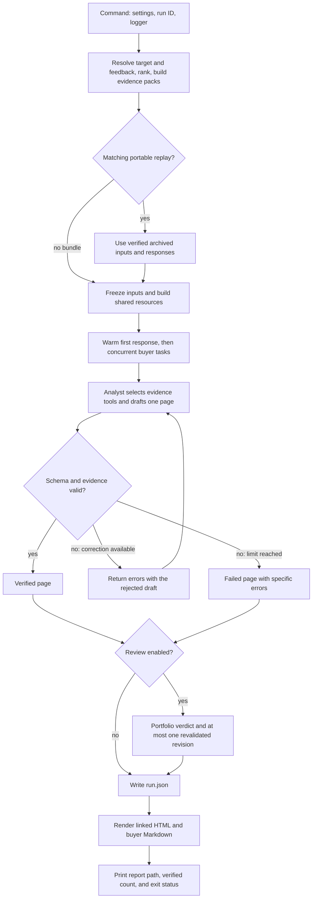

# Follow one run

Read the product path in this order. Start with the inputs and outputs of each
stage; follow a boundary implementation only when its behavior needs explaining.

| Order | Entry point | What it owns |
| --- | --- | --- |
| 1 | [`cli.py`](src/acquirer_engine/cli.py): `build_app` | Command registration and saved-run inspection |
| 2 | [`run_command.py`](src/acquirer_engine/run_command.py): `run_product` | Flags, settings, run identity, logger, display, and exit status |
| 3 | [`selection.py`](src/acquirer_engine/selection.py): `prepare_selection` | Target YAML/flag precedence, saved feedback, ranking, and evidence packs |
| 4 | [`pipeline.py`](src/acquirer_engine/pipeline.py): `execute_run`, `execute_prepared` | Select current or archived inputs, freeze the run, execute the portfolio, and persist results |
| 5 | [`bootstrap.py`](src/acquirer_engine/bootstrap.py): `model_resources`, `build_services` | Build shared clients, agents, tools, ledger, cache, and trace before buyer tasks start |
| 6 | [`llm/analyst.py`](src/acquirer_engine/llm/analyst.py): `run_analysts`, `analyze_one` | Concurrent buyer tasks and each page's complete draft/validation/recovery loop |
| 7 | [`report/render.py`](src/acquirer_engine/report/render.py): `render_report` | Public HTML, buyer Markdown, and canonical evidence tables |

This is a reading order, not a stack trace: `run_product` calls the pipeline,
which calls selection before executing the prepared portfolio. After the pipeline
returns, the command renders the saved result and prints its paths.

The diagram summarizes control flow. A portable bundle mismatch fails rather
than using different responses. Provider failures and resource limits end that
page directly; they do not enter validation repair. Other buyers continue.
The CLI exits nonzero if any page or the portfolio review fails.

## The complete buyer loop in one file

[`llm/analyst.py`](src/acquirer_engine/llm/analyst.py) contains the execution steps
in reading order:

1. `run_analysts` starts one buyer to warm the shared prefix, then runs the other
   tasks behind the concurrency semaphore and preserves ranked output order.
2. `analyze_one` creates buyer-local evidence state, chooses the normal or sparse
   agent, and drives generation until the page passes or recovery stops.
3. `generate` runs the injected agent, retains its messages, and records the
   validation outcome and claim counts for that attempt.
4. `next_route` turns the outcome and recovery limits into pass, repair,
   escalation, or a failed page with a banner.
5. `repair_history` returns precise errors against the rejected output call while
   preserving its draft and retrieved evidence for the next attempt.

The shipped configuration allows one same-tier repair, with escalation disabled.
The optional escalation route remains configurable; it is not exercised by the
selected sample. The portfolio reviewer is also disabled by default and lives
in its own module. These choices and their measurements are in [ROUTING.md](ROUTING.md).

Agent construction stays outside this loop. `llm/agents.py` declares typed tool
bindings and the output validator; `validation/claims.py` performs deterministic
checks on the supplied evidence. A model chooses tools and writes a draft; code
checks it and selects the next route. No buyer creates a provider client.

## Thirteen model-stage modules

The package groups execution, evidence, provider, and replay responsibilities.
Small independent boundaries remain separate when combining them would couple
unrelated callers.

| Module | Responsibility |
| --- | --- |
| [`analyst.py`](src/acquirer_engine/llm/analyst.py) | Batch scheduling, one-page execution, route decisions, and repair feedback |
| [`agents.py`](src/acquirer_engine/llm/agents.py) | Agent declarations, five typed tool bindings, output validation, and reviewer coverage checks |
| [`tools.py`](src/acquirer_engine/llm/tools.py) | Deterministic evidence queries, query schemas, buyer-local provenance, and saved continuation state |
| [`reviewer.py`](src/acquirer_engine/llm/reviewer.py) | Optional portfolio critique and one revalidated revision per flagged page |
| [`recording.py`](src/acquirer_engine/llm/recording.py) | Shared request boundary: deadlines, request identity, live/replay selection, usage, and failure capture |
| [`provider.py`](src/acquirer_engine/llm/provider.py) | Provider-client construction, retry eligibility, schema compatibility, truncation, and safe error messages |
| [`cost.py`](src/acquirer_engine/llm/cost.py) | Returned-usage accounting, admission reservations, token estimates, and uncertain charges |
| [`results.py`](src/acquirer_engine/llm/results.py) | Typed page attempts, final pages, reviewer verdicts, and run artifacts |
| [`trace.py`](src/acquirer_engine/llm/trace.py) | Append-only events and exact historical response/failure matching |
| [`archive.py`](src/acquirer_engine/llm/archive.py) | Frozen input snapshots and safe run-directory selection |
| [`cache.py`](src/acquirer_engine/llm/cache.py) | Content-addressed request identity and atomic response reuse |
| [`config.py`](src/acquirer_engine/llm/config.py) | Typed analyst execution settings, independent of runtime construction |
| [`framing.py`](src/acquirer_engine/llm/framing.py) | Escaped JSON data boundaries shared by analyst, comparison, and judge prompts |

Shared state reaches code through `Deps.runtime`. Each buyer has its own
`ToolState`, accessed by the framework through `PageDeps`. The verifier sees only
that buyer's core evidence and actual returned tool evidence. Its `PageSession`
retains the conversation for a possible reviewer revision. These local state
types sit beside the queries in `llm/tools.py`; they do not create shared clients.

## Follow a fact or failure

| Question | Where to look |
| --- | --- |
| Why this buyer, score, and conviction? | `features/acquirer.py`, `ranking/signals.py`, and `ranking/scorer.py`; the scorer also owns shrinkage and conviction |
| Which facts were initially supplied? | `evidence/pack.py` |
| Which facts did the model actually fetch? | Typed bindings in `llm/agents.py`; queries and recorded provenance in `llm/tools.py` |
| Why did a number or citation fail? | `validation/claims.py`, `validation/numbers.py` |
| Which qualitative phrasing is checked? | `validation/prose.py`: recognized margin inversions, partial-history theme exclusivity, and configured boilerplate |
| Where do visible deal financials come from? | `report/evidence.py` resolves source rows and statistics before rendering |
| Why did a request wait or stop? | `llm/recording.py`, `llm/cost.py`, `llm/provider.py` |
| What did a returned response cost? | `llm/cost.py` and the call entries in `run.json` |
| Where are conversation and continuation state? | `llm/tools.py` and local `trace.jsonl`, written by `llm/trace.py` |

The core pack prioritizes exact target-sector deals before recency within the row
and byte caps. Closed, Pending, and resolved counts retain full-history scope even
when displayed rows are truncated. Tools remain necessary for Closed valuation
comps and population sector benchmarks.

The narrow prose guards are not general semantic verification. Passing numeric
and reference checks does not certify an investment thesis. Structural
consolidation changes neither that proof boundary nor the measured ranking,
speed, cost, or independent-calibration limitations in [docs/EVALS.md](docs/EVALS.md).

## Live, cache replay, and historical replay

- `acquirers run --fresh`: prepare current inputs and make provider requests.
- `acquirers run --replay`: prepare current inputs and use matching response-cache
  entries when no bundle is installed. A committed portable bundle is checked
  first for exact inputs, feedback, prompt, policy, and file integrity. A mismatch
  fails without a provider fallback.
- `acquirers replay RUN_ID`: load frozen inputs from the selected `snapshot.json`
  and responses from `trace.jsonl`, then enter `execute_prepared` with no client.

`llm/archive.py` owns frozen inputs; `llm/trace.py` matches historical responses
to conversations. `llm/cache.py` owns content-addressed response reuse. These are
separate contracts. Historical replay writes a new run and retains lineage to the
original; it does not overwrite the source archive or run old code. Failed
requests replay their typed error. Only explicit archived failure evidence can
restore legacy failures. Missing responses never become invented answers or usage.

## Evaluation takes another path

`acquirers eval` enters [`evals/command.py`](evals/command.py): `run_evaluation`.
The command assembles `PreparedEvaluation`, calls `evaluate` in
[`evals/harness.py`](evals/harness.py) to run the selected graders, and writes the
scorecard through `evals/scorecard.py`.
The preparation modules are named for what they measure:

| Preparation | Module and function |
| --- | --- |
| Ranking holdout, baselines, and ablations | `evals/ranking/prepare.py`: `prepare_ranking` |
| Evidence fixtures and groundedness | `evals/groundedness.py`: `prepare_groundedness` |
| Saved analyst outcomes and run-cohort checks | `evals/analyst.py`: `prepare_analyst`, `load_runs` |
| Recovery and ablation observations | `evals/routing.py`: `prepare_routing` |
| Independent judge observations | `evals/judges/grading.py`: `prepare_judges` |

Supplied run files are observations; evaluation never drafts buyer pages. The
product path does not execute graders. Paid judge execution remains separate
from report generation, and missing human calibration stays explicitly unmeasured.
Evaluation tests live in `tests/evaluation`; shared factories and hand-built
ranking/rationale examples live in `tests/fixtures`.

## Display, preferences, and comparison

`report/render.py` projects public fields into small Jinja templates.
`report/evidence.py` resolves visible citations and deal financials before files
are written. Working notes remain in the structured run, never the public pages.

`selection.py` owns target YAML/flag precedence and the common input-preparation
path. `feedback/state.py` saves named exclusions; `feedback/ranking.py` applies
a disclosed similarity penalty after the base scorer.

`comparison/command.py` prepares two selections, computes differences through
`comparison/ranking.py`, and saves a table. Optional `comparison/summary.py` uses
the existing recorded model boundary, with one request and no output retry.
`comparison/results.py` keeps summary failures separate from valid ranking facts.
Default comparison never constructs a provider client.
